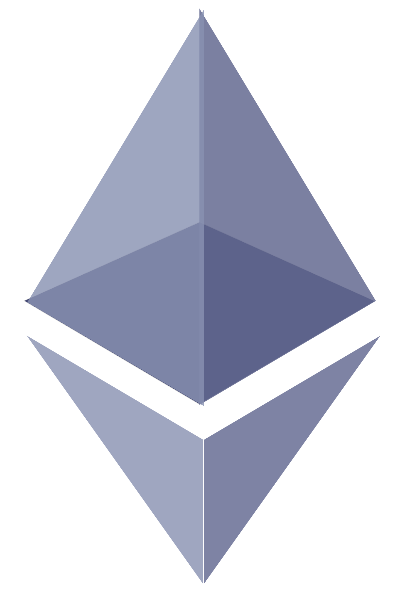
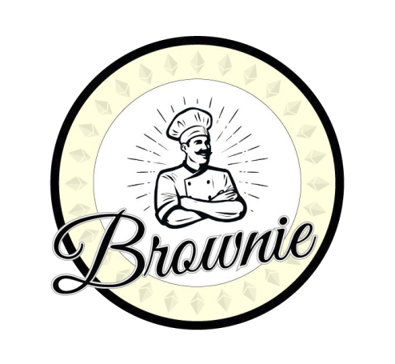

<h3>Hey 👋</h3>
  
**i'm a university student and have been programming since I was 11 years old (big nerd... I know). I love to keep myself busy (maybe a bit too busy) with a bunch of extra curriculars and hackathon stuff.**
### Showcase 🚀
- I won **first place** at ETHDenver 2024 **AND** 2025, **the world's largest crypto hackathon**, with [BeFit](https://devfolio.co/projects/befit-98df) and [FaceBuddy](https://devfolio.co/projects/facebuddy-0154) respectively **($35k in prizes)**. Watch the winning presentations: [BeFit Presentation](https://www.youtube.com/watch?v=zh5fxWYE8W0) & [FaceBuddy Presentation](https://www.youtube.com/watch?v=RnsvtOcVArA).
- I also won first place in ETHGlobal Waterloo with a tool that recovers your lost tokens! Watch my [on-stage presentation](https://www.youtube.com/live/_I3kAYZ4_eo?si=Jd0ePwqvBpPYApn1&t=1341), and [check out the project here](https://ethglobal.com/showcase/token-rescue-buddy-bd0sd)!

  
  
  

  

  

### Skills over the years 👷🛠️
##### Programming Languages

 

#####  Tools/Frameworks

 

##### IoT

 

## Hobbies/Interests!
- sports with friends 🎾
- machine learning 👨‍💻
- carpool karaoke  🎤
- hackathons 🏆
- reading 📖
- gym & cross-country 💪

### What I'm doing now... 🔎
- College
- Studying PyTorch & other ML related things

### What I'm looking forward to doing next... 🔮
- Getting an internship for Winter / Summer 2026 - feel free to reach out if you thought my github was cool!

## Github Stats
 

## Contact
If you have any questions, feedback, or work/internship inquiries, I would love to chat!

Email: hello@xavierdmello.com
